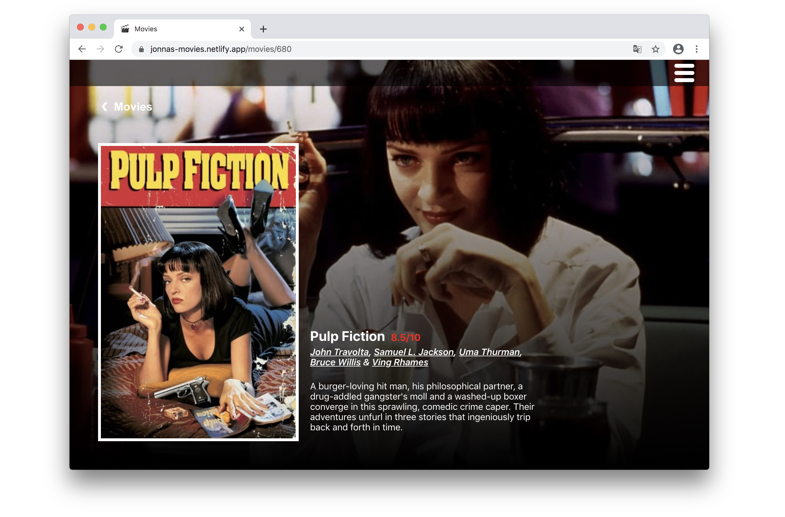

# Movie Browser&ensp;|&ensp;[View Live &#10555;](https://olle-react-movie-list.netlify.app/)

A multi-page application using React Router to browse movies fetched from themoviedb.org's API.
Using placeholders in urls to access specific movies based on their ID. 

The app fetches the data when components mounts using useEffect and stores it with useState.
useParams from react-router-dom gets the move id from the url, so additional information can be fetched when visiting a specific movie page.

I also added a loading state that shows a spinner while fetching new information. 

## Core Tech
* React
* React Router
* useEffect
* useState
* useParams

## Screenshot

## View it live
https://olle-react-movie-list.netlify.app/